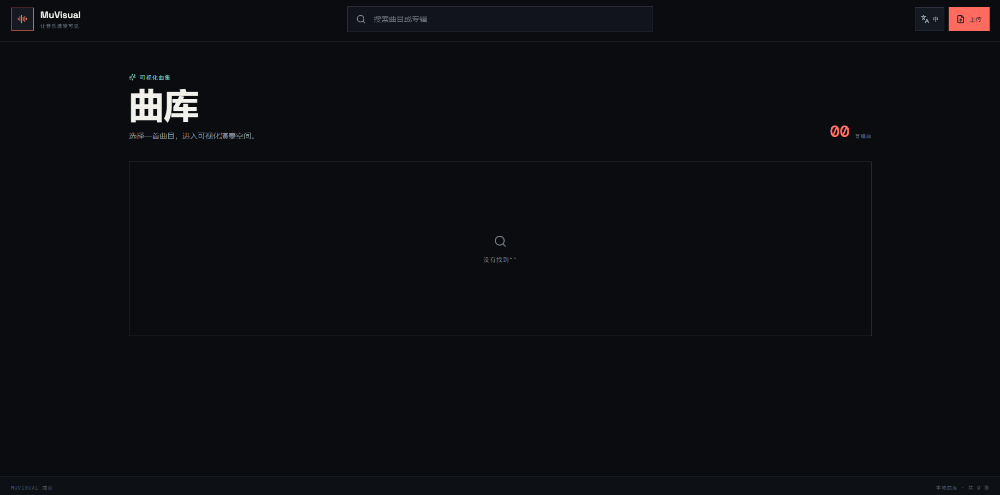
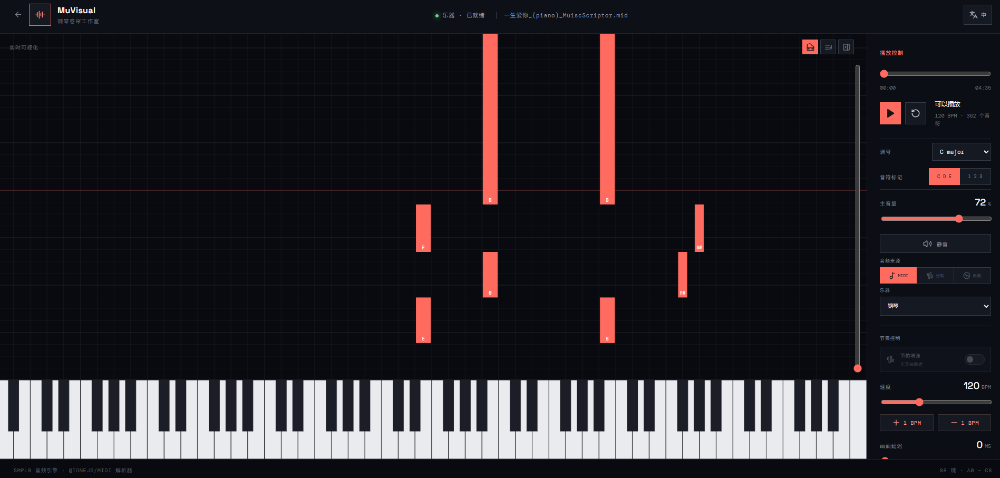

<div align="center">

# MuVisual

An interactive workspace for exploring music through piano-roll visualization, numbered notation, and multi-track playback.

**English** | [简体中文](./README.zh-CN.md)

</div>

## Table of Contents

- [Overview](#overview)
- [Preview](#preview)
- [Features](#features)
- [Tech Stack](#tech-stack)
- [Getting Started](#getting-started)
- [Configuration](#configuration)
- [Docker](#docker)
- [Available Scripts](#available-scripts)
- [Project Structure](#project-structure)

## Overview

MuVisual turns MIDI files and processed audio tracks into an interactive music workspace. Browse a local library, inspect notes in a real-time piano roll or numbered notation view, switch between available instrument stems, and control playback from one interface.

The application includes a React frontend and a lightweight Node.js backend. MIDI files are parsed locally in the browser. Audio uploads can optionally be sent to a configured Modal service for beat analysis, stem separation, and MIDI extraction.

## Preview

### Music Library



### Studio



## Features

- Searchable library for preset and processed tracks
- Local MIDI import without uploading the file to the server
- Optional audio processing workflow with persistent job recovery
- Real-time piano-roll visualization with chord recognition
- Numbered musical notation view
- MIDI, isolated instrument, and original-track playback sources
- Instrument stem switching for piano, vocals, bass, drums, guitar, and other parts
- Adjustable tempo, key signature, volume, timeline delay, and note labels
- Beat-grid enhancement when beat analysis is available
- English and Simplified Chinese interfaces
- Password-protected access with signed HTTP-only sessions

## Tech Stack

- React 18 and TypeScript
- Vite 5
- Tone.js MIDI and smplr
- MediaBunny
- Node.js HTTP server
- Docker

## Getting Started

### Requirements

- Node.js 22 or later
- npm

### Installation

1. Clone the repository:

   ```bash
   git clone https://github.com/TecReaGroup/MuVisual.git
   cd MuVisual
   ```

2. Install dependencies:

   ```bash
   npm install
   ```

3. Create a local environment file from the example and set `AUTH_PASSWORD`:

   ```bash
   cp .env.example .env
   ```

4. Start the backend:

   ```bash
   npm run backend
   ```

5. In another terminal, start the Vite development server:

   ```bash
   npm run dev
   ```

6. Open the URL printed by Vite, usually `http://localhost:5173`, and sign in with the configured password.

The development server proxies `/api`, `/auth`, and `/media` requests to `http://localhost:8787`.

## Configuration

| Variable | Required | Description |
| --- | --- | --- |
| `AUTH_PASSWORD` | Yes | Password used to sign in and sign authenticated sessions. |
| `PORT` | No | Backend port. Defaults to `8787`. |
| `MODAL_URL` | For audio uploads | Base URL of the audio-processing service. The backend uses its `/submit` and `/result/:id` endpoints. |
| `MODAL_KEY` | No | Modal proxy authentication key. |
| `MODAL_SECRET` | No | Modal proxy authentication secret. |

MIDI import works without Modal configuration. Audio processing requires `MODAL_URL`; configure both Modal credentials when the endpoint has proxy authentication enabled.

Runtime library files are read from:

- `backend/data/visual` for preset tracks
- `backend/data/modal` for processed uploads and job state
- `backend/data/log` for backend logs

## Docker

Build the production image:

```bash
docker build -t muvisual .
```

Run the container:

```bash
docker run --rm \
  -p 8787:8787 \
  -e AUTH_PASSWORD=change-me \
  -e MODAL_URL=https://your-modal-service.example \
  -e MODAL_KEY=your-key \
  -e MODAL_SECRET=your-secret \
  -v /absolute/path/to/backend/data:/app/backend/data \
  muvisual
```

Then open `http://localhost:8787`. The Modal variables can be omitted when audio upload processing is not needed. Use a persistent volume if library tracks, processed uploads, job state, and logs must survive container replacement.

## Available Scripts

| Command | Description |
| --- | --- |
| `npm run dev` | Start the Vite development server. |
| `npm run backend` | Start the Node.js backend. |
| `npm run build` | Type-check and build the production frontend. |
| `npm run preview` | Preview the production frontend build. |

## Project Structure

```text
MuVisual/
├── backend/          # Authentication, library, media, and audio-processing server
├── public/           # Bundled fonts, audio samples, icons, and preview images
├── src/
│   ├── app/          # Application entry and page routing
│   ├── entities/     # Music domain types and timeline logic
│   ├── features/     # Import, playback, piano-roll, and score features
│   ├── pages/        # Login, library, and studio pages
│   └── shared/       # Shared localization and formatting code
├── Dockerfile
├── package.json
└── vite.config.ts
```
